# FreeIPA server on Linux
### Introduction
What you're expecting is some kind of step-by-step tutorial for an OpenLDAP server but I won't do that. The main reason we are here is to learn what is an FreeIPA server and how to create our own lab to work on.

The things we are going to do here:
- A virtual router
- A DHCP server
- A FreeIPA server
- 2 clients

Everything We are going to do will be hosted on Ubuntu server 24.04. You can do this on another distro if you want but I did this before on this distro so I'm comfortable with it.
Requirements:
- A machine to deploy every server
- 1 Client

If you want to create the VMs on VirtualBox, you can go for it (I'm going to show how to do it on this program). You can use Proxmox or VMware if It fits you the most, but take in account that proxmox will need and entire pc with decent specifications.

 

### Virtual Router
First of all I'm going to explain why we are doing this. Well, we could just use our own router but to be more flexible and just to make it a bit harder we are going to create our own router to route traffic. Why? Because we can control everything: firewall, traffic, routing tables...
The other thing I would like to show is how NAT works, because by the time we create the rest of the servers inside our LAN we would like to make them go outside of the LAN and connect with Internet, so we will need iptables (maybe we will learn nftables, a modern version of iptables).

After the explanation, before installing the distro we have to give our router two network adapters:
1. Bridged
2. Internal red (the name is up to you, I'm going to leave it on default)

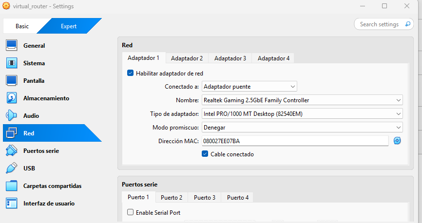
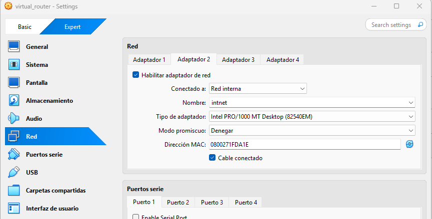

After that we got to install everything. I'm not going to show everything about the installation process so I'm going to show you the configuration of the network and leave the rest up to you.

My configuration is this one (remember to change every adapter to manual, because DHCP is on by default):

For enp0s3 (the bridged adapter):
      
      --> Subnet: 192.168.0.0/21
  
      --> Address: 192.168.1.100
  
      --> Gateway: 192.168.1.1
  
      --> Name servers: 8.8.8.8, 8.8.4.4

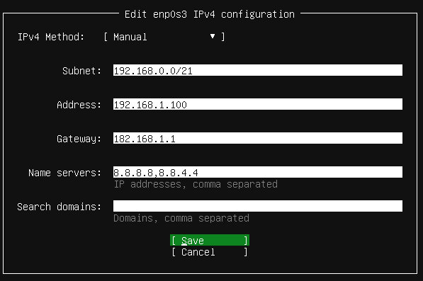
 

For enp0s8 (the internal adapter):
      
      --> Subnet: 10.0.0.0/24
  
      --> Address: 10.0.0.1
  
      --> Gateway: 192.168.1.100
  
      --> Name servers: 8.8.8.8, 8.8.4.4

 

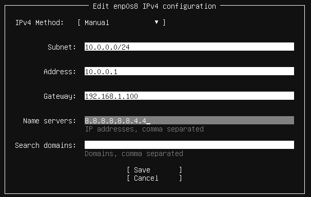
 
 
 

After the installation we could use netplan, but... What is it?
Well, Netplan is a network configuration tool used in modern Ubuntu systems.
It uses YAML files in **/etc/netplan/** to set up network interfaces, including IP addresses, DHCP, gateways, and DNS.

It works with NetworkManager or systemd-networkd to apply the network settings.

Right now we don't want to touch anything related to netplan but I'm going to show you how it looks like right now:
  
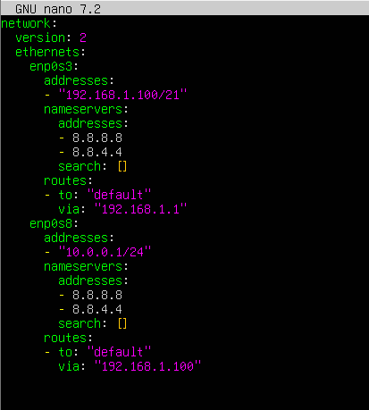

 
 

After that we should install SSH just to facilitate the use of the terminal. If you don't know already, SSH (Secure Shell) is a protocol used to securely connect to remote computers over a network.
It allows you to log in, execute commands, and transfer files safely using encryption. It is commonly used by system administrators and developers to manage servers and virtual machines. The syntax is pretty simple:
      
      $ ssh -p [port of the server] [user]@[server_address]

 
 

The server address should be the IP and the user should be the user we could use in the server. The port, well, it's going to be 22, the SSH default port.

Installing SSH is easy because you just need **$ sudo apt install ssh -y**.

The next think we got to do is enable IP forwarding permanently. Here is a brief explanation about this:

  --> IP forwarding is a setting in the Linux kernel that allows the router to send network packets from one network interface to another. Without it, the router will receive packets from the client but won’t forward them to the Internet.

  --> The FORWARD chain in iptables/nftables handles packets that are being routed through the system, so enabling IP forwarding allows these packets to actually pass through the router.
 
 To make this change permanent (so it stays active after reboot), we edit the sysctl.conf file (/etc/sysctl.conf). This file contains kernel settings that Linux applies at startup. So we just open the file and then, look for the line containing net.ipv4.ip_forward and set it to 1:
   
 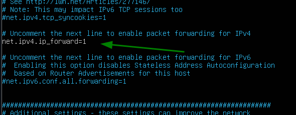

After this, we simply apply the updated system parameters without needing to reboot the router. We do this by running:

      $ sudo sysctl -p

Next, we need to create an iptables rule that allows packets from the servers (we will create them after this) to reach the external network and receive responses back through the router. In other words, we want the router to perform NAT so that internal devices can access the outside network using the router’s external IP address. To do this, we add the following rule and we keep it permanent (remember to install **iptables-persistent** to use netfilter-persistent):
            
      $ sudo iptables -t nat -A POSTROUTING -o enp0s3 -j SNAT --to-source 192.168.1.100
      $ sudo netfilter-persistent save

And now we have our own router and LAN, making everything posible thanks to the magic of the NAT technique.

The next thing we should do is make our own DHCP to give IP addresses to our clients. In the next part I will explain how to create it and make it work with a cliente (I won't explain the client part because it's easy and there are tons of tutorials out there to know how to setup a Linux cliente).

 

### DHCP Server
In this part I'm going to create a DHCP server but what exactly is DHCP?

DHCP (Dynamic Host Configuration Protocol) is the service responsible for automatically giving devices on a network the information they need to connect and communicate. Instead of configuring every computer manually, a DHCP server assigns important settings such as the IP address, subnet mask, gateway, and DNS servers as soon as a device joins the network.

When a client connects, it sends out a broadcast request asking for network configuration. The DHCP server listens for that request and responds with a lease — a temporary set of network parameters the client can use. This makes network management simpler, prevents IP conflicts, and allows devices to join the network instantly without any manual setup.

In short, DHCP is what allows your devices to “plug in and work” by automatically configuring their network settings.

So by now we are going to create the DHCP server. Just remember, the adapter has to be on internal mode.

The network configuration is going to be this one:
      
      --> Subnet: 10.0.0.0/24
  
      --> Address: 10.0.0.2
  
      --> Gateway: 10.0.0.1
  
      --> Name servers: 8.8.8.8, 8.8.4.4

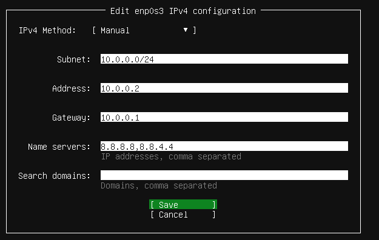

Next, we will install the ISC DHCP server software (developed by the open-source organization ISC) so that we can begin configuring our DHCP server.

      $ sudo apt update
      $ sudo apt install isc-dhcp-server -y

If you want to look at the status of the service you could use this command:

      $ sudo systemctl status isc-dhcp-server

After installing the software, we need to configure the server so that it can start assigning dynamic IP addresses to devices on the network. To do this, we will edit the dhcpd.conf file located in the /etc/dhcp directory, where all the main settings for the DHCP server are defined, including the IP address range, subnet mask, gateway, and DNS servers. This configuration file is essential because it tells the server how to manage and distribute network settings to clients automatically.

At the end of the configuration file, we add the following lines:
      
      # Subnet configuration for the internal network (10.0.0.0/24)
      subnet 10.0.0.0 netmask 255.255.255.0 {
              range 10.0.0.10 10.0.0.50;
              option routers 10.0.0.1;
              option domain-name-servers 8.8.8.8, 8.8.4.4;
              default-lease-time 600;
              max-lease-time 7200;
      }

This block defines the DHCP settings for your internal network:
1. **subnet 10.0.0.0 netmask 255.255.255.0** specifies the network where the DHCP server will assign IPs.
2. **range 10.0.0.10 10.0.0.50** defines the pool of addresses that clients can receive dynamically.
3. **option routers 10.0.0.1** sets the default gateway for the clients (usually the router).
4. **option domain-name-servers 8.8.8.8, 8.8.4.4** tells clients which DNS servers to use.
5. **default-lease-time 600 and max-lease-time 7200** define the lease duration in seconds (how long a client can keep the assigned IP).

In short, this configuration ensures that any device connecting to your internal LAN automatically receives an IP address, gateway, and DNS settings, making network management much simpler.

After saving the configuration we need to edit the iscp-dhcp-server file located in the /etc/default directory. This file is used to set default parameters for the DHCP server service. It specifies which network interfaces the DHCP server should listen on, and can include other startup options. Editing this file ensures that when the DHCP service starts, it knows exactly which network interface(s) to manage, so it only assigns IP addresses to clients on your internal LAN and avoids affecting other networks. Essentially, it acts as a bridge between your system’s configuration and the running DHCP service.

From there, in the line INTERFACESv4="", we will specify the network interface on which the DHCP server should “listen” and offer IP addresses to clients that send requests for an IP. In my case, the machine’s interface is enp0s3.

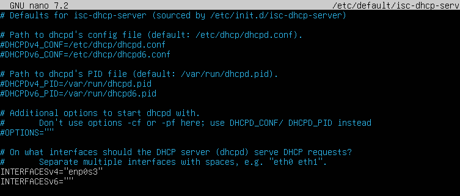

So now our DHCP server is fully configured. We could assign static IPs if needed, but at the moment it’s not necessary since we don’t have any clients or servers that require a fixed IP address.
Before we go to the DNS server I'm going to explain to you how you can fix an IP address to any client but I won't go too deep.

First of all, we need the MAC address for it. If you still don’t know what a MAC address is, it stands for Media Access Control address, a unique identifier assigned to the network interface of every device. Think of it like a device’s fingerprint on the network. The DHCP server uses this MAC address to recognize the device and, if configured, assign it a specific IP address every time it connects. To get it we need the commando **$ ip a**. After this, We will look for the line link/ether, which contains the MAC address of the machine. We will need this address later to manually assign a static IP to this client from the DHCP server. The client’s MAC address is 08:00:27:6b:50:8b.

After this, we will configure a new entry in the dhcpd.conf file located in /etc/dhcp. The entry is as follows:
      
      host client {
        hardware ethernet 08:00:27:6b:50:8b;
        fixed-address 10.0.0.55;
        option routers 10.0.0.1;
        option subnet-mask 255.255.255.0;
      }

This line in the dhcpd.conf file creates a static IP reservation. The host client block tells the DHCP server that the device named "client" should receive a special configuration. The server uses the device’s MAC address (hardware ethernet) to uniquely identify it. When the client connects, the server always assigns it the same predefined IP address (fixed-address 10.0.0.55) instead of an address from the dynamic range.

Lo último que deberíamos hacer es resetear el servicio y la máquina, y tras esto ya tendríamos el cliente con su nueva IP. Para resetear el servicio:
      
      $ sudo systemctl restart isc-dhpc-service

I'm not going to show anything related to the fixed IP because it's not necessary for the FreeIPA, but you got to know that even if you configure the IP of the client manually or you put it on automatic, you should fix the address in the DHCP server, so it won't produce erros or problems if any other device recive the same IP. Just as advice.

### FreeIPA Server
We will now begin the deployment of our FreeIPA server. We have selected CentOS for this environment, as FreeIPA offers better native compatibility and a more robust integration path compared to Ubuntu Server (you can obtain the CentOS 10 ISO from the official repository here: https://www.centos.org/download/).
Before proceeding with the configuration, let’s review the network topology. We will be provisioning three virtual machines within our private LAN:
1. IPA Master Server
2. IPA Replica Node
3. Client Node"

 

**Understanding IdM and FreeIPA**

You can think of FreeIPA as the Linux equivalent of Active Directory. It is an open-source Identity Management (IdM) solution that centralizes authentication, authorization, and policy enforcement.

 

**Why use a Centralized Domain?**

In a standard environment, every server acts as an island—passwords are stored locally, and each machine must be managed individually. This creates massive administrative overhead and security risks. IdM solves this by creating a unified Linux domain where all information is stored in one place and applied uniformly to every machine.

 

**How it Works?**

The architecture is built on three core pillars:
1. **LDAP:** The directory service that stores all user, group, and policy data.
2. **Kerberos:** The engine for Single Sign-On (SSO). Once a user authenticates, they can access any service in the domain without re-entering their credentials.
3. **Integrated Services:** The server also manages DNS for service discovery and a Certificate Authority (CA) for secure communication.

 

**The Role of Clients**

IdM Clients are machines enrolled in the domain to receive these identities and policies. While the domain is Linux-native (meaning it does not support Windows clients directly), it can be integrated with existing Active Directory environments to share identities across your entire enterprise.

So now we know what is FreeIPA and its relation with IdM and RedHat.

For now, we will focus on the installation. Ensure that you configure the network settings during the initial setup. While you can choose your own partitioning and system settings, make sure your network adapter is set to Internal Network (or Host-Only) to isolate the traffic within your lab.

Once the OS is installed and you have logged in, our first task on the Master Server is to update the hostname. For this guide, I will use ipa1.lab.local.

I am using .local because of specific restrictions regarding Top-Level Domains (TLDs). Using reserved names like localhost or public domains like example.com can cause conflicts. For more details, see (https://datatracker.ietf.org/doc/html/rfc2606).+

Why do we have to change the hostname?

Well, the reason is clear: In a domain, your machine needs a full identity.

To understand this, think of the hostname as the "first name" of your computer (example: ipa1) and the domain as its "last name" or "neighborhood" (example: lab.local). When you put them together, you get the FQDN (Fully Qualified Domain Name): ipa1.lab.local.

In FreeIPA, this relationship is vital because:

- **It’s like an ID Card:** FreeIPA uses a system called Kerberos to handle logins. Kerberos is very strict; it doesn't recognize machines by their IP addresses, only by their full names (FQDN). If the name is wrong, you can't log in.

- **DNS is the Foundation:** FreeIPA acts as a phonebook for your network. For other machines to find the server and trust it, the server must have a fixed, clear name that doesn't change.

- **Security Certificates:** The server creates security certificates (like digital signatures) to protect your data. These signatures are tied specifically to the hostname. If the name is incorrect, the security system will block the connection.

In short, changing the hostname ensures that your server has a unique and permanent identity so the entire network knows exactly who it is talking to.

After changing the hostname we will need to change the file **hosts** inside the dir. **/etc/**. Why we need to do this? Well, even though we told the computer its name, it still needs a way to find itself without asking an external router. By adding our IP and hostname to the /etc/hosts file, we are creating a local map. It means you are telling the system: "Don't go outside to ask anyone; I'm telling you right here that this name belongs to this IP".

This ensures that the server can always resolve its own name to its IP address—even before the full DNS service is up and running. If FreeIPA tries to start and the server can't find itself, the installation will fail. It's essentially giving the machine a mirror so it can confirm its own identity.

Right now the IP for my master server is 10.0.0.3 and the line I wrote on the file was this:

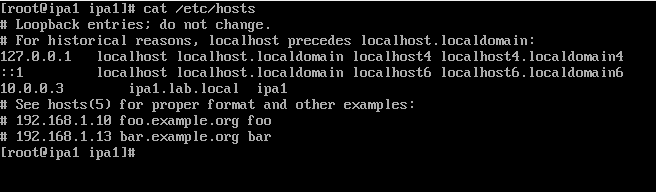

 

You're probably wondering why I put "ipa1" at the end of the line. The purpose of it is just as a shothard for the server, so if you type something like "$ ping ipa1" it will work because it still means the full address (ipa1.lab.local).

Now we need to do a ping to the machine itself, so make sure that when u do **$ ping ipa1** it works. After that, make sure that the file **resolv.conf** inside **/etc/** is the same as the photo:

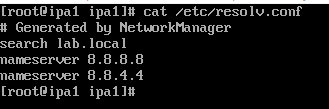

 

The reason we use these external DNS addresses is that we are still in the pre-installation phase. Since the FreeIPA DNS service isn't running yet, pointing the server to its own IP would leave it unable to resolve web addresses, preventing it from downloading the packages required for the installation.

Now we have to install the necessary code from the repositories. We require this command for it:

      # yum install ipa-server ipa-server-dns -y

The reason for by adding **ipa-server-dns* is that we are telling CentOS to also download the components needed to manage our own DNS records (the BIND service).

However, simply downloading the software isn't enough to make it work. Think of the first command as getting the tools, and the second command as building the house. We must run **ipa-server-install** to actually configure the domain, set up security certificates, and turn the machine into a functional Domain Controller. So we have to use this:

      # ipa-server-install

It will execute a script providing an interactive setup for the IPA server and it will ask a series of questions, and after answering them, you should end up with something like this:

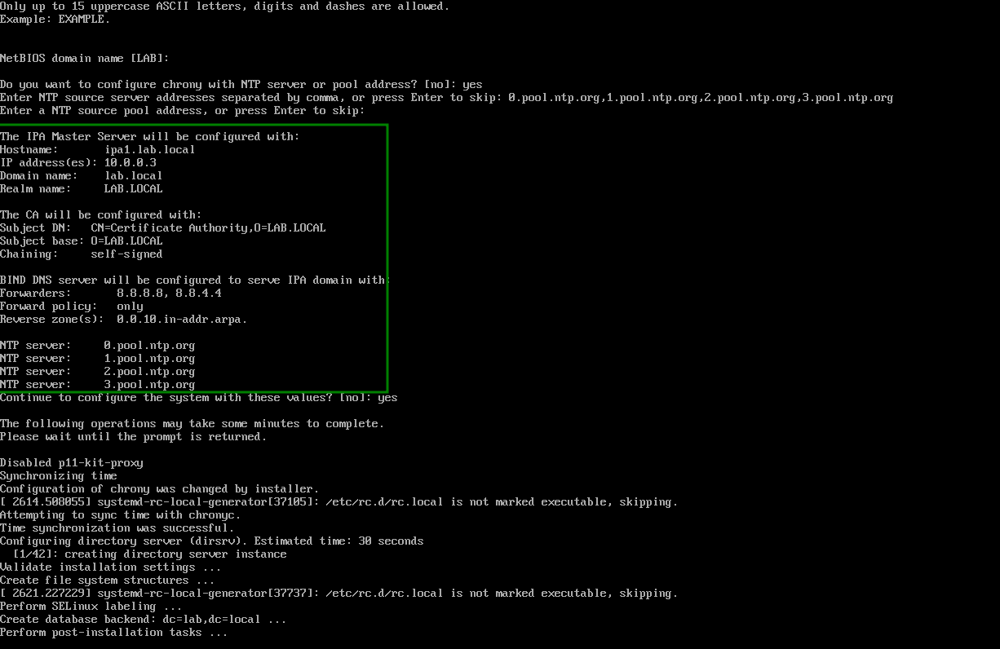

 

As you can see we just setup lot of things importante for the server, These things are: 

- **Hostname and IP:** The server is officially identified as ipa1.lab.local at the static IP 10.0.0.3.
- **Domain and Realm:** We have established lab.local as our DNS domain and LAB.LOCAL as our Kerberos Realm (used for authentication).
- **Certificate Authority (CA):** The server is now its own CA, allowing it to issue digital certificates to secure communications within the domain.
- **DNS Forwarders:** It is configured to use 8.8.8.8 and 8.8.4.4. This means if the server doesn't know a web address, it will ask Google's DNS.
- **NTP Synchronization:** The server will sync its time with the pool.ntp.org servers, which is critical because Kerberos authentication fails if the time is not exact.
- **Reverse Zone:** It automatically created a reverse DNS zone (0.0.10.in-addr.arpa), which allows the network to translate IPs back into names."

After the configuration finish, one message is going to prompt to us via terminal saying that we need to open some ports for the server to work properly. We are going to use this commands to open them so the firewall don't put as in trouble:

      # firewall-cmd --add-service=freeipa-4 --permanent
      # firewall-cmd --reload

The ports we are opening are this ones: Kerberos, HTTP, HTTPS, DNS, LDAP and LDAPS.

We could check the ports with this command:

      # firewall-cmd --list-all

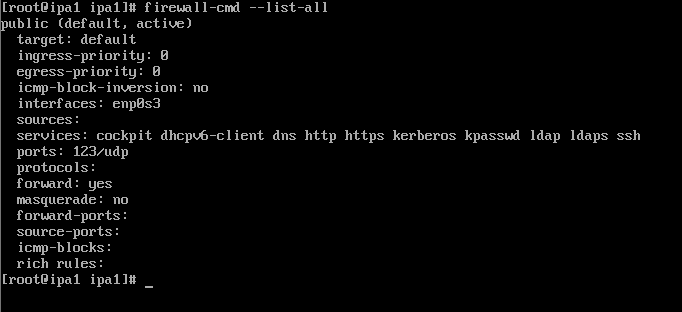

 

As you can notice in the photo everything works fine.

After completing the installation and opening the firewall, the server is "alive," but there is one final step. In FreeIPA, being the "root" user of the machine isn't enough; you must verify your identity with Kerberos, the security system that manages permissions within the domain. We are going to need this commando:

      # kinit admin

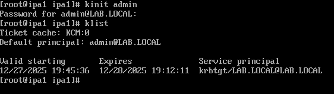

 

By running the command kinit admin, you are officially logging into the FreeIPA realm. The system will ask for the password you created during setup. If it's correct, the cursor will simply move to the next line without an error message. In Linux, this "silence" is the perfect sign: it means your identity was successfully verified.

Behind the scenes, the server grants you a Ticket Granting Ticket (TGT). Think of it as a "VIP wristband." Once you have it, you can access and manage different areas of the server for the next several hours without having to re-type your password every few minutes.

This step is the ultimate test for your setup. If kinit admin works, it proves that your DNS, Firewall, and Kerberos service are all perfectly synchronized. Your FreeIPA server is now fully operational and ready for action.
